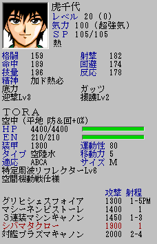

** 内容はSRC2.2.33のものです **

**ステータスウインドウ**

ユニット・パイロットの状態を表示します。ウインドウに表示されるユニットを変更するにはマップウインドウのユニット上にマウスカーソルを持ってくればＯＫです。

ユニットに複数のパイロットが乗り込んでいる場合、パイロットの顔グラフィック表示窓をクリックすることでステータス表示するパイロットを変更することができます。

下の図をクリックすれば表示項目についての解説が表示されます。

