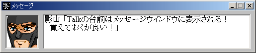
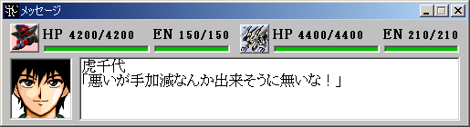

** 内容はSRC2.2.33のものです **

**メッセージウインドウ**

各種のメッセージを表示します。次のメッセージを読むにはメッセージウインドウかマップウインドウをクリックすればＯＫです。メッセージを自動送りにするにはパイロット画像の部分をクリックしてください。ウィンドウのタイトルが「メッセージ (自動送り)」に変わり、メッセージが自動的に更新されます。

戦闘時のメッセージの場合はユニットのＨＰ・ＥＮが追加表示されます。またメッセージは自動送りされます。

戦闘メッセージの表示速度を変えるにはマップコマンド「[設定変更](設定変更.md)」から「メッセージスピード」を選択してください。
