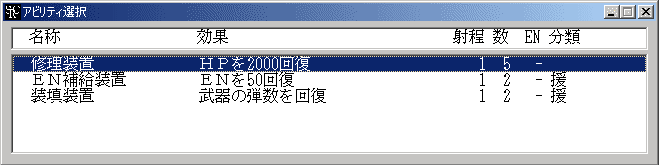

** 内容はSRC2.2.33のものです **

**アビリティ**

ユニットが持っているアビリティを使用します。アビリティとはＨＰの回復や、特殊能力を付加等、戦闘を有利にするユニットの補助能力のことです。

ユニットコマンドメニューからアビリティを選択するとアビリティ一覧が表示されます(アビリティが複数ある場合)。この中から使用するアビリティを選んで下さい。アビリティ名の前につけられている「×」は回数切れ、ＥＮ不足などの理由からそのアビリティが使用できないことを示します。

**項目名解説**

**効果**アビリティの効果です

ＨＰ回復、状態異常の回復、特殊能力の付加、ユニットの召喚

などがあります

**射程**アビリティの射程です。射程が0のアビリティは自分にのみ使用できます

**数**アビリティの残り使用回数です。

「-」と表示されている場合は回数制でないアビリティです

**EN**ＥＮ消費量です。使用するごとに表示されている量のＥＮが消費されます

「-」と表示されている場合はＥＮ消費制でないアビリティです

**属性**アビリティの特性を示したものです。属性の効果はアビリティ一覧で参照できます

アビリティの必要気力も「**気**数字」としてここに表示されます

[メインパイロット](メインパイロット.md)の[気力](気力.md)が必要気力以上でないとそのアビリティは使用できません

使用するアビリティを選択するとアビリティの射程範囲が表示されます。

（射程が0のアビリティや召喚アビリティはその場でアビリティが実行されます）

射程範囲から使用目標を選び、目標上で左クリックしてアビリティを使用します。右クリックでコマンドをキャンセルできます。マップを動かすときはユニット上以外の場所で左ボタンを押しながらマウスを動かしてください。

武器の場合と同じく、アビリティにも複数のユニットに効果が及ぶマップ型アビリティが存在します（効果にＭが指定されているもの）。マップ型アビリティの効果範囲についてはユニットコマンド「[攻撃](攻撃.md)」の解説を参照してください。
