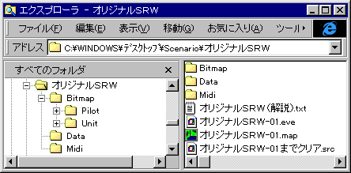

** 内容はSRC2.2.33のものです **
**シナリオの構成**

シナリオは独立した一つのフォルダに格納されます。フォルダ名はシナリオ名と同一にしておくのがいいでしょう。フォルダ内にはシナリオで使用するデータや画像、イベントファイルのすべてを含む必要があります。多くのシナリオの場合、ファイル構成は以下のようになります。

【シナリオ名のフォルダ】

│

├ イベントファイル各種

│

├── Bitmap

│     ├── Pilot

│     │     └── パイロットアイコン各種

│     │

│     └── Unit

│            └── ユニットアイコン各種

│

└── Data

├── System

│     ├── Exit.eve

│     ├── GameOver.eve

│     ├── alias.txt

│     ├── item.txt

│     └── sp.txt

│

├── 作品名

│     ├── データ各種

：     ：

シナリオによってはさらに

**Bitmap\Mapフォルダ**自作のマップ画像

**Midiフォルダ**自作もしくは添付許可をもらったMidiファイルを格納

**Soundフォルダ**自作の効果音ファイル

などが加わることもあるでしょう。このようにシナリオ用にシナリオのフォルダ内に収納されたデータをローカルデータと呼びます。

画像ファイル、データファイルは開発パックから必要な作品のものをそのままコピーすればＯＫです。もちろん一から自作してもかまいません。自作の方法については[データの作成](データを作成する前に.md)のページを参照してください。

なお、多くの開発パックにおいてはデータファイルはシナリオに合わせて自由に改変可能ですが、画像ファイルを改変したい場合は画像作者の了解が必要であることが普通です。データや画像を改変して使用する場合にはまず開発パックの注意書きをお読みください。また、使用した画像の作者名をシナリオ解説のスペシャルサンクスに表記することが義務付けられている場合もあります。このような使用条件についても開発パックの注意書きに従ってください。

DataフォルダにあるSystemフォルダは特殊なフォルダとなっており、シナリオ中断時やゲームオーバーの際の処理を行うイベントファイルや汎用アイテムデータ、標準スペシャルパワーファイルなどが含まれています。このフォルダの作成方法については[Systemフォルダ](Systemフォルダ.md)のページを参照してください。

イベントファイルとして必要なものは以下の２種類のファイルです。

[**イベントデータ**](イベントデータ.md)１つのステージ各種のイベントを定義したデータ(.eve)

[**マップデータ**](マップデータ.md)戦闘時のマップデータ(.map)

イベントデータとマップデータを拡張子だけが異なるファイル名にしておけば、ステージに対応するマップファイルが自動的に表示されます。異なるファイル名にしておいて[**ChangeMap**コマンド](ChangeMapコマンド.md)でマップを表示する方法もあります。なお、順番が分かりやすいようにファイル名の最後は二桁の数字にしておくことをお勧めします。

**例**
```sh
シナリオ-01.eveシナリオ-01.map
イベントデータはテキストエディタで、マップデータはMapEdit.exeで作成します。それぞれのデータの作り方については双方の解説を参照してください。

```

