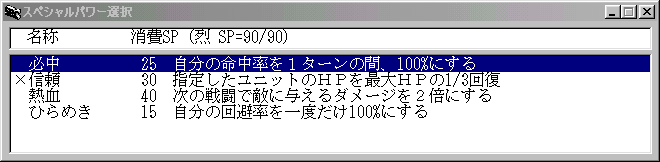
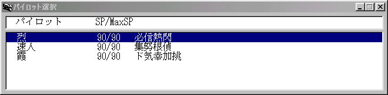

** 内容はSRC2.2.33のものです **
**スペシャルパワー**

スペシャルパワー(ＳＰ)を使用します。

スペシャルパワーはどんな窮地にも負けないヒーローの力を表現したものです。精神力を現わすＳＰを消費するとことでさまざまな効果を得ることができます。

スペシャルパワーは自作が可能になっているため、パイロットが使用できるスペシャルパワーの種類はシナリオによって異なります。以下に一般的に使われているスペシャルパワーの例を示します。なお、コストや効果は実際のものと異なる場合があります。

**名称（略称）コスト効果**

**愛**（愛）90味方の全ユニットのＨＰを全快させる

**足かせ**（足）10指定したユニットの移動力を１ターン半減

（条件：相手より技量が上）

**威圧**（威）30指定したユニットを１ターン行動不能にする

（条件：相手より技量が上＆[BossRank](BossRankコマンド.md)を持っていない）

**祈り**（祈）120破壊されたユニットを１つ復活させる

**癒し**（癒）100指定したユニットのパイロットのＳＰを50回復

(ユニットに複数のパイロットが乗っている場合、回復量は 10+50/パイロット数)

**応援**（応）30指定したユニットに努力の効果を与える

**覚醒**（覚）60自分の行動数を１つ増やす

**かく乱**（乱）70全ての敵ユニットの命中率を１ターン半減する

**隠れ身**（隠）40１ターンの間身を隠す。敵ユニットからの反撃も無効化

**加速**（加）10１ターンの間、移動力+2

**気合**（気）40自分の[気力](気力.md)を+10

**奇襲**（襲）60加速＋熱血＋必中＋ひらめき

**奇跡**（奇）100加速＋魂＋必中＋ひらめき＋幸運＋気合×３＋ド根性

**激怒**（怒）70全ての敵ユニットに10～1000のダメージ

**激闘**（闘）60１ターンの間、攻撃のダメージを1.5倍

**激励**（励）70指定したユニットのパイロットの気力を+10

**幸運**（幸）45次の戦闘で敵を破壊すれば獲得資金が2倍

**鼓舞**（鼓）120味方の全ユニットのパイロットの気力を+5

**根性**（根）20自分のＨＰを最大ＨＰの1/3回復

**再動**（再）70指定した行動済みユニットを行動可能にする

**自爆**（爆）1自爆し、周りのユニットに自分のＨＰ分のダメージを与える

**集中**（集）15１ターンの間、命中＆回避+30

**祝福**（祝）60指定したユニットに幸運の効果を与える

**神速**（速）15１ターンの間、移動力+3

**信頼**（信）30指定したユニットのＨＰを最大ＨＰの1/3回復

**捨て身**（捨）50攻撃のダメージを３倍する代わりに敵の攻撃に対して完全に無防備になる

(敵から攻撃を受けるか、１ターン経過するまで継続。反撃時無効)

**戦慄**（慄）120全ての敵の気力を-5

**狙撃**（狙）201ターンの間、武器の最大射程を+1

(射程が2以上で「Ｍ」「武」「突」「接」「有」属性を持たない武器のみ)

**脱力**（脱）50指定したユニットのパイロットの気力を-10

**魂**（魂）60次の戦闘で敵に与えるダメージを3倍にする

**挑発**（挑）35指定したユニットの攻撃を自分に引き付ける

**直撃**（直）20次の攻撃の際に敵の切り払いや分身等の回避系特殊能力、シールド防御、

[サポートガード](サポートガード.md)を無効化する

**偵察**（偵）1指定したユニットの獲得資金と経験値を調べる

**てかげん**（手）10自分より技量の低い敵を倒さないように手加減する

**鉄壁**（壁）30１ターンの間、装甲を2倍にする

**ド根性**（ド）40自分のＨＰを全快する

**突撃**（突）25次の戦闘でマップ攻撃以外の長射程武器が移動後も使用可能になる

**努力**（努）20次の戦闘で得られる経験値を2倍にする

**熱血**（熱）40次の戦闘で敵に与えるダメージを2倍にする

**必中**（必）25自分の命中率を１ターンの間、100%になる（ひらめきには無効）

**ひらめき**（閃）15相手の命中率を１回だけ0%にする

**復活**（復）50敵の攻撃でＨＰが０になっても自動的に復活する

(自爆技等で自殺した場合は無効)

**補給**（補）70指定したユニットのＥＮ・弾数を全快。ただし気力-10

**みがわり**（身）10指定したユニットを一度だけかばう

かばった際のダメージは通常の半分

**見極め**（見）25マップ攻撃による攻撃が敵のみにダメージ

**魅惑**（魅）30指定したユニットを１ターン命中＆回避-30

（条件：相手より技量が上）

**瞑想**（瞑）50自分のＥＮ及び霊力を全快

**友情**（友）70味方の全ユニットのＨＰを最大ＨＰの1/2だけ回復

**夢**（夢）不定任意のスペシャルパワーを消費ＳＰ２倍で実行

（条件：出撃中の味方パイロットのいずれかがそのスペシャルパワーを修得している）

パイロットによって使用できるスペシャルパワーは異なります。SRCで戦闘の鍵を握るのはスペシャルパワーです。パイロットのスペシャルパワーを把握し、戦いを有利に進めましょう。パイロットはレベルが上がるに従って新しいスペシャルパワーを修得していきます。またＳＰ値もレベルが上がるに従って増えていきます。

ユニットコマンドメニューからスペシャルパワーを選択するとスペシャルパワーの一覧が表示されます。

**表示項目解説**

**スペシャルパワー名**スペシャルパワーの名称です

**消費SP**スペシャルパワーの実行に必要なＳＰ値です

**効果**スペシャルパワーの効果の概要です

効果を参考にして適切なスペシャルパワーを選択してください。キャンセルは右クリックです。ダイアログの最初の行に表示されているのはスペシャルパワーを実行するパイロットの現在のＳＰ／最大ＳＰです。残りＳＰに注意してください。先頭に「×」のついたスペシャルパワーはＳＰが足りない、使用しても効果がないため使用不可になっているスペシャルパワーです。

スペシャルパワーには効果が一定時間継続するものもあります。現在使用中のスペシャルパワーはステータスウインドウに表示されています。それぞれのコマンドは漢字一文字で表わされています。基本的には頭文字が使われています。

スペシャルパワーによっては他のユニットに対して使用するものもあります。ダイアログによる指示にしたがって目標を選択してください。

選択したユニットに複数のパイロットが乗っている場合にはまずスペシャルパワーを使用するパイロットを選ぶことが必要です。

**表示項目解説**

**パイロット名**乗っているパイロットの名称です

**残りＳＰ／最大ＳＰ**パイロットの残りＳＰ値、最大ＳＰ値です

**スペシャルパワー一覧**使用可能なスペシャルパワーの一覧です

スペシャルパワーは大変便利ですがあまり濫用しているとステージ終了時に残りＳＰ値に従って得られるボーナス経験値が下がってしまいます。無駄な使用は控えた方が良いでしょう。

ボーナス経験値の値は、

ボーナス経験値 ＝ 2 × 残りＳＰ値

となっています。

 シナリオによってはボーナス経験値が得られなくなっている場合があります。
