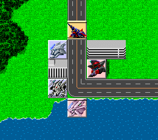

** 内容はSRC2.2.33のものです **

**マップウインドウ**

戦闘の舞台となるマップを表わしたものです。マップ全体のうち、15×15の範囲が表示されています。

**マップウインドウの表示内容について**

ユニットの所属する[陣営](陣営名.md)はユニットの色によって示されています。

**味方ユニット**青色

**敵ユニット**赤色

**中立ユニット**黄色

ユニットのいる位置はユニット上に入れられている線で判別できます。

**地上・水上**線なし

**空中**下部に線

**水中**上部に線

**地中**両側に線

網掛けで表示されているユニットは行動済み、もしくは行動不能のものです。

ユニット用のビットマップが用意されていないユニットは空白のまま表示されます。
