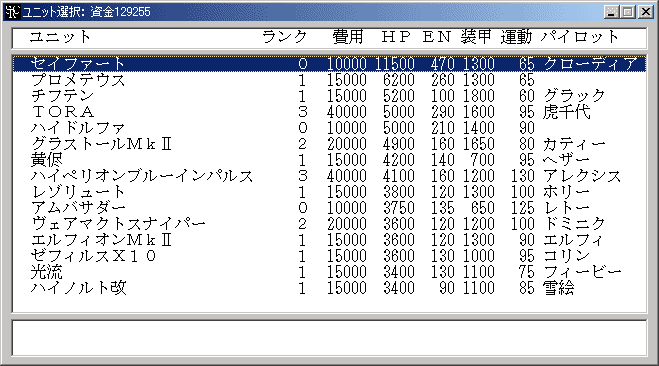

**機体改造**

ユニットを改造し、[ユニットランク](ユニットランク.md)を上げて強化します。ユニット一覧から改造するユニットを選択して下さい。右クリックでキャンセル可能です。ユニットが[人間ユニット](人間ユニット.md)であるシナリオではコマンド名は「ユニットの強化」になります。

改造するには資金が必要ですが、改造にかかる額はユニットランクが高くなるほど多くなります。改造に必要な改造費や最大改造数はシナリオの設定によって異なります。また、改造費や最大改造数がユニット側で変更されている場合もあります(ユニット用特殊能力「改造費修正」「最大改造数」)。

**(1)通常の１０段階改造**

**ユニットランク改造費用**

**0**10000

**1**15000

**2**20000

**3**40000

**4**80000

**5**150000

**6**200000

**7**300000

**8**400000

**9**500000

**10**改造不可

シナリオ中で[**Option**コマンド](Optionコマンド.md)により最大改造数が５段階に設定された場合も

こちらの改造費が使われます。

**(2)１５段階改造**

**ユニットランク改造費用**

**0**10000

**1**15000

**2**20000

**3**40000

**4**80000

**5**120000

**6**160000

**7**200000

**8**250000

**9**300000

**10**350000

**11**400000

**12**450000

**13**500000

**14**550000

**15**改造不可

**(3)低改造費**

**ユニットランク改造費用**

**0**10000

**1**15000

**2**20000

**3**30000

**4**40000

**5**50000

**6**60000

**7**70000

**8**80000

**9**100000

**10**120000

**11**140000

**12**160000

**13**180000

**14**200000

**15**改造不可

シナリオ中で[**Option**コマンド](Optionコマンド.md)により低改造費モードが選択されている

場合は最大改造数が５段階や１５段階に変更された場合もこちらの改造費が使われます。

資金は敵を倒す事によって得られます。資金の最大値は999999999です。

改造による効果は以下のようになっています。

**項目効果**

ＨＰ＋200×ユニットランク

ＥＮ＋10×ユニットランク

装甲＋100×ユニットランク

運動性＋5×ユニットランク

武器攻撃力＋100×ユニットランク

（武器属性「[Ｒ](攻撃力変動に関する属性.md)」や「[改](攻撃力変動に関する属性.md)」を持つ場合、攻撃力の増加率は変わります）

複数の形態を持つユニットを改造した場合、他の形態へのユニットランクの影響は次のようになります。

**変形、ハイパーモード、パーツ分離、換装、変形技を持つユニット**

変形先のユニットランクも改造したユニットのユニットランクと同じ値まで強化されます。

**合体形態が標準のユニット**

３体合体以上のユニット、主形態指定を持つユニットがこれに該当します。

合体形態・分離形態のすべてのユニットが同じユニットランクまで強化されます。これは合体後の形態がまだ存在せず、合体ができない状態にも適用されます。

**分離形態が標準のユニット**

２体合体のユニット、合体が制限時間付きのユニットがこれに該当します。

合体後の形態のユニットランクは分離形態のユニットのユニットランクのうち最も高いものに合わされます。各分離ユニットのユニットランクは連動しません。
