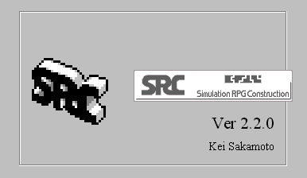
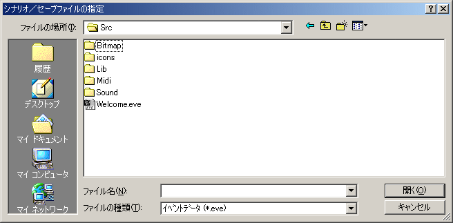

** 内容はSRC2.2.33のものです **

**SRCの起動**

SRCをそのまま起動するとタイトル画面が表示されます。ここでSRCのバージョンを確認することができます。

タイトル画面の後、「シナリオ／セーブファイルの指定」のダイアログが開きます。ここで読み込むファイルを指定します。

**シナリオを最初からプレイする**

プレイするシナリオの最初のイベントデータファイル（\*.eve）を指定して読み込みます。どのイベントデータファイルがシナリオの最初のファイルであるかはシナリオによって異なるので、シナリオに添付されたドキュメント(Readme.txt等)を参照して下さい。

**シナリオを前回の続きからプレイする**

セーブデータファイル（\*.src）を指定して読み込みます。

イベントデータファイルとセーブデータをSRCに関連付けておけば「シナリオ／セーブファイルの指定」ダイアログを経由せずにファイルをロードすることができます。関連付けを行うにはファイルをダブルクリックし、「ファイルを開くアプリケーションの選択」で「その他」を選んだ後、SRCを選択すればＯＫです。

これ以外にもイベントデータファイルやセーブデータファイルをSRCにドラッグ＆ドロップすることでSRCを起動することもできます。
