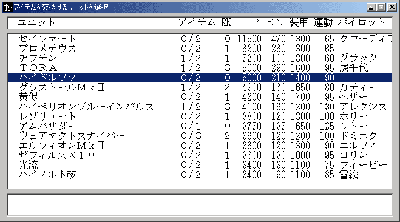
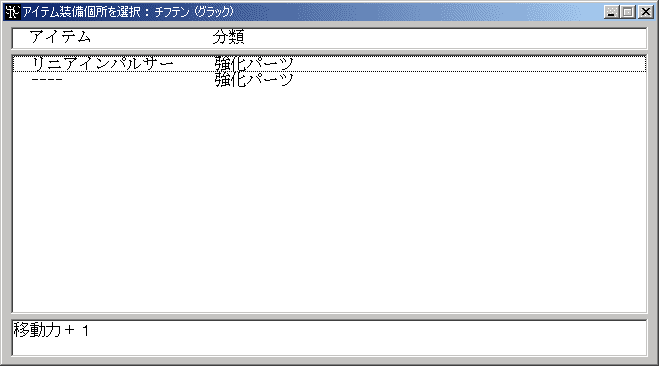

** 内容はSRC2.2.33のものです **

**アイテム交換**

アイテムの装備・付け替えを行います。

アイテム交換コマンドはシナリオ側で[**Option**コマンド](Optionコマンド.md)を使って使用可能にしている場合にのみ表示されます。

ユニット一覧が表示されるのでアイテムの付け替えを行うユニットを選択して下さい。

続いてどのアイテムを外す・交換するかを選んで下さい。ここで**装備解除**を選択するとアイテムを外すことになります。新規にアイテムを装備するには空欄を選択します。欄の数がそのユニットが装備できるアイテムの数を示しています。（ユニットが特殊な装備タイプでない場合）

次に装備するアイテムの種類を選んで下さい。選択したアイテムが先ほど選択したアイテムと入れ替えられます。**分類**の最後に「[数字]」が付けられているものはそのアイテムが装備個所をその数だけ使用することを示しています。

最後に選択した種類のアイテムのうち、どのアイテムを装備するかを決定し、アイテムの装備が完了します。
