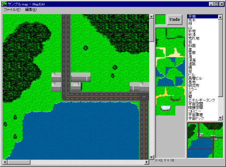

** 内容はSRC2.2.33のものです **

**マップデータ**

マップデータは戦闘用のマップを定義したものです。MapEdit.exeを利用して作成します。

**MapEdit**

MapEditの画面構成です。図の各部分をクリックするとその部分の説明を読むことができます。

基本操作は次の通りです。

**左クリック** **右クリック**

**マップウインドウ**地形描画地形をスポイト

**地形グラフィック選択リスト**グラフィックを選択

**地形タイプ選択リスト**地形を選択

**全体マップウインドウ**画面を移動

**Undoボタン**直前の状態に戻す

**Copyボタン**コピー領域の選択を開始する

**Pasteボタン**コピーした領域を書き込む

左クリックを押すことで選択した地形(右上の隅のウィンドウに描かれている地形)をマウスカーソルの地点に描画します。違うグラフィックを選択する場合は右の地形グラフィック選択ウインドウからクリックして選んで下さい。違う種類の地形のリストを出したい場合は、右端の地形タイプ選択ウインドウを使います。マウスの右ボタンにはスポイト機能が割り当てられています。このボタンを押すとマウスカーソル位置にある地形が選択されます。

マップの一部をコピーするにはCopyボタンを押してからマップウインドウ上でマウスの左ボタンを押し、そのまま左ボタンを押しつづけてマウスカーソルを動かしてコピーする領域を決めます。コピーしたい領域を囲えたらマウスボタンを離してください。選択した領域がコピーされます。この状態でもう一度左ボタンを押すと選択した領域をコピーして動かすことができます。コピーした領域を動かすにはPasteボタンを押してからマップウインドウ上でマウスの左ボタンを押します。そのままボタンを押しつづければ書き込む領域を表示させたままドラッグして移動させることができます。マウスボタンを離すと書きこみが行われます。

画面をスクロールするには３つの方法があります。

・マップウィンドウのスクロールバーを使う

・全体マップウィンドウをクリックもしくはドラッグ

・マウスカーソルをマップウィンドウ端でしばらく静止させる

作成したデータはファイルメニューから保存してください。マップデータのファイル名はイベントデータのファイル名と拡張子だけ異なるように統一しておく必要があります。

マップサイズの変更はファイルメニューからマップサイズ変更で行います。マップの幅、マップの高さは最低でもそれぞれ15必要です。マップサイズの上限は50×50に設定されていますが、マップサイズが大きくなるとマシンスペックによっては著しく処理速度が低下します。最大でも30×30程度にとどめておいた方が良いでしょう。

MapEditを立ち上げたときにはマップがマス目と一緒に表示されます。マス目の表示をなくしたい時にはメニューの「表示」=&gt;「マス目表示」を選んで表示を切り替えてください。

マップを描き始めるときは編集メニューから塗りつぶしを使うと便利です。

シナリオ側で地形データを定義している場合は一旦新規にマップデータを作成してシナリオフォルダにセーブした後、MapEditからマップデータを読み込んでください。

**地形データ**

マップ中で使用可能な地形は以下の通りです。データの意味は右から地形名、地形タイプ、移動コスト、命中修正、ダメージ修正、ＨＰ回復量、ＥＮ回復量、ビットマップ名となっています。

なお、[地形データ](地形データ.md)を使って独自の地形を定義したり、下記の地形データの内容を変更することも出来ます。

平地          陸1  +0  -0  +0  +0 plain

低木陸2  +5  -5  +0  +0 bush

林陸2 +15 -10  +0  +0 woods

大樹空1  +0  -0  +0  +0 big\_tree

山陸3 +30 -30  +0  +0 mountain

砂地陸1  +0  -0  +0  +0 sand

砂漠陸2  +5  -0  +0  +0 desert

荒れ地陸1  +0  -0  +0  +0 waste\_land

岩陸2  +5  -5  +0  +0 rock

丘陸2  +5  -5  +0  +0 hill

斜面陸2  +5  -5  +0  +0 slope

崖空1  +0  -0  +0  +0 cliff

洞窟陸2 +25 -25  +0  +0 cave

クレーター(地上)陸2 +20 -20  +0  +0 earth\_crater

雪原陸2  +0  -0  +0  +0 snow

海水2  +5  -5  +0  +0 sea

湖水2  +5  -5  +0  +0 lake

沼水2  +5  -5  +0  +0 swamp

川水2  +5  -5  +0  +0 river

滝空1  +0  -0  +0  +0 fall

深海深水2 +25 -25  +0  +0 deep\_sea

岩礁空1  +0  -0  +0  +0 rock\_reef

道路陸1  +0  -5  +0  +0 road

道路(残骸)陸1  +0  -5  +0  +0 destroyed\_road

橋陸1  +0  -5  +0  +0 bridge

線路陸1  +0  -5  +0  +0 railroad

街陸2 +25 -25  +0 +10 town

ビル陸2 +25 -25  +0 -10 building

高層ビル空1  +0  -0  +0  +0 skyscraper

基地陸2 +30 -30 +10 +20 base

研究所陸2 +30 -30 +10 +20 laboratory

発電所陸2 +15 -15 +0  +20 powerplant

城塞陸2 +30 -30 +10 +20 castle

防壁空1  +0  -0  +0  +0 barrier

廃墟陸2 +20 -20  +0  +0 remains

遺跡陸2 +25 -25  +0  +0 ruins

ミラー空1  +0  -0  +0  +0 mirror

空空1  +0  -0  +0  +0 sky

床屋内1  +0  -0  +0  +0 floor

壁空-  +0  -0  +0  +0 wall

入口屋内2  +5  -5  +0  +0 gate

机屋内3  +0  -0  +0  +0 desk

照明屋内1 -10  -0  +0  +0 light

障害物(小)屋内1  +5  -5  +0  +0 small\_block

障害物(大)空1  +0  -0  +0  +0 large\_block

エネルギータンク屋内1  +0  -5  +0 +20 energy\_tank

宇宙空間宇宙1  +0  -0  +0  +0 space

暗礁空間宇宙2 +20 -20  +0  +0 asteroids

残骸宇宙2 +20 -20  +0  +0 wrecks

コロニー宇宙2 +20 -20  +0 +10 colony

宇宙要塞宇宙2 +30 -30 +10 +20 space\_fortress

宇宙ドック宇宙2 +10 -10 +20 +30 space\_dock

地球宇宙1  +0  -0  +0  +0 earth

月宇宙1  +0  -0  +0  +0 moon

火星宇宙1  +0  -0  +0  +0 mars

木星宇宙1  +0  -0  +0  +0 jupiter

土星宇宙1  +0  -0  +0  +0 saturn

惑星宇宙1  +0  -0  +0  +0 planet

衛星宇宙1  +0  -0  +0  +0 satellite

恒星宇宙1  +0  -0  +0  +0 star

超新星宇宙1  +0  -0  +0  +0 super\_nova

星間ガス宇宙1  +0 -20  +0  +0 space\_gas

宇宙気流宇宙2  +5  -5  +0  +0 space\_current

彗星宇宙1  +0  -0  +0  +0 comet

ブラックホール宇宙1  +0  -0  +0  +0 black\_hole

月面月面1  +0  -0  +0  +0 moon\_ground

月の海月面1  +0  -0  +0  +0 moon\_sea

クレーター(小)月面2 +20 -20  +0  +0 small\_crater

クレーター(大)月面3 +20 -20  +0  +0 large\_crater

月面都市月面2 +25 -25  +0 +10 moon\_city

月面基地月面2 +30 -30 +10 +20 moon\_base

平地(火星)陸1  +0  -0  +0  +0 mars\_plain

荒れ地(火星)陸1  +0  -0  +0  +0 mars\_waste\_land

岩(火星)陸2  +5  -5  +0  +0 mars\_rock

斜面(火星)陸2  +5  -5  +0  +0 mars\_slope

崖(火星)空1  +0  -0  +0  +0 mars\_cliff

クレーター(火星)陸2 +20 -20  +0  +0 mars\_crater

火星都市陸2 +25 -25  +0 +10 mars\_city

火星基地陸2 +30 -30 +10 +20 mars\_base

－陸1  +0  -0  +0  +0 blank

これらの地形データは Data\System\terrain.txt に定義されています。詳しくは[地形データ](地形データ.md)の項を参照して下さい。

マップの種類は左上隅(1,1)の地形タイプで決定されます。マップの種類はターン開始時に流れるＢＧＭの種類の他、[**Organize**コマンド](Organizeコマンド.md)の部隊編成リストに表示されるユニットの種類に影響します。

**地形用ビットマップ**

各地形のビットマップには "ビットマップ名"+数字+".bmp" という名前のビットマップファイルになっています(例、plain0.bmp, building2.bmp など)。なお、同じ地形のビットマップの番号は0からスタートし、4桁の数字で指定してください。

**例** woods0000.bmp, woods0001.bmp, woods0002.bmp, ...

なお、最初の「0」の部分を省略したwoods1.bmpのような指定でも扱うことが出来ますが、ファイル一覧の見易さのため、4桁で指定することをお薦めします。また「0」を省略した指定の場合、下記の「Bitmap\Map\"ビットマップ名"」のフォルダに対するファイル検索が行われません。

地形用ビットマップは

**(1) シナリオのあるフォルダ\Bitmap\Map\"ビットマップ名"**

**(2) シナリオのあるフォルダ\Bitmap\Map**

**(3) Src.exeのあるフォルダ\Bitmap\Map\"ビットマップ名"**

**(4) Src.exeのあるフォルダ\Bitmap\Map**

の順で検索され、使用されます。

**例** 平地のビットマップ(plain0000.bmp, plain0001.bmp, ...)は以下の順で検索

(1) シナリオのあるフォルダ\Bitmap\Map\plain

(2) シナリオのあるフォルダ\Bitmap\Map

(3) Src.exeのあるフォルダ\Bitmap\Map\plain

(4) Src.exeのあるフォルダ\Bitmap\Map

シナリオ独自のビットマップを使いたい場合はビットマップ名を

"ビットマップ名-"+数字+".bmp"

という形にしてください。数字は1から指定します。

**例** woods-0001.bmp, woods-0002.bmp, woods-0003.bmp, ...

上記のように番号を指定したビットマップはMapEditの地形タイプ選択ウィンドウに地形名(ローカル) として表示されます。

シナリオ独自のビットマップをMapEditで選択できるようにするにはマップデータがシナリオと同じフォルダ内にある必要があります。最初にマップを作る際は一旦ローカルなビットマップを使わずにマップデータをセーブし、再読み込みを行ってください。
