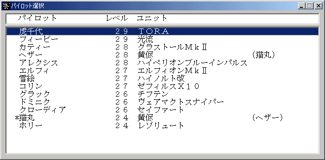
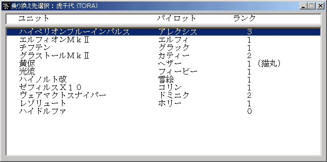

** 内容はSRC2.2.33のものです **

**乗り換え**

パイロットを違うユニットに乗せ換えます。

乗り換えコマンドはシナリオ側で[**Option**コマンド](Optionコマンド.md)を使って使用可能にしている場合にのみ表示されます。

また、3人乗り以上のユニットや複数のサポートパイロットが乗っているユニットの

パイロットは乗り換えできません。

乗り換えを選択すると乗り換え可能なパイロットの一覧が表示されます。この中から乗り換えさせるパイロットを選んで下さい。右クリックでキャンセルできます。

パイロットを選択するとそのパイロットが搭乗可能なユニットの一覧が表示されます。乗り換え先を選んで下さい。

パイロット名の前に「\*」が付けられているのは[サポートパイロット](サポートパイロット.md)です。サポートパイロットの乗り換えは通常のパイロットと若干異なります。サポートパイロットは単独でユニットに乗り込むことができません。従って[メインパイロット](メインパイロット.md)とサポートパイロットを乗り換えさせるときにはまずメインパイロットを乗り換えさせ、次にサポートパイロットを乗り換えさせてください。

パイロット名の前に「-」が付けられている場合、そのパイロットは ２人乗りのユニットに乗り込んでおり、かつまだパイロット数が必要数に達してません。このままでは部隊編成時に出撃させることができないので、他のパイロットを乗り込ませて出撃できるようにしてください。なお、２人乗りユニットに乗り込んだパイロット場合は名前の後に何番目のパイロットか表示されます。
