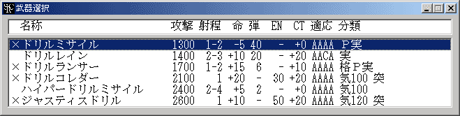
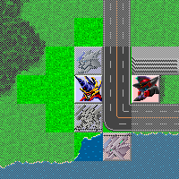

** 内容はSRC2.2.33のものです **

**攻撃**

ユニットを攻撃させます。

ユニットコマンドメニューから攻撃を選択すると武器一覧が表示されます。この中から使用する武器を選んで下さい。武器名の前につけられている「×」は弾切れ、ＥＮ不足などの理由からその武器が使用できないことを示します。[サポートアタック](サポートアタック.md)が可能である場合はサポートアタックのオン・オフもこの時に選択可能です。

**項目名解説**

**攻撃**武器の攻撃力です

**射程**武器の射程です。最低射程距離、最大射程距離の順になっています

最低射程距離未満、最大射程距離以降の敵には攻撃はできません

**命**命中率修正です。

**弾**残弾数です。

使用ごとに 1 ずつ減少し、0 になるとそれ以上使用できなくなります

「-」と表示されている場合は弾数制ではない武器です

**EN**ＥＮ消費量です。使用するごとに表示されている量のＥＮが消費されます

「-」と表示されている場合はＥＮ消費制ではない武器です

**CT**クリティカル発生率の修正値です

特殊効果の発生率にも影響します

**適応**武器の地形適応です。空、陸、水中、宇宙の順で書かれており

S =&gt; A =&gt; B =&gt; C =&gt; D

の順に威力が低下します

「-」の場合はその地形にいる敵には攻撃できません

**属性**武器の特性を示したものです。[武装一覧](武装一覧.md)でそれぞれの効果を調べることができます

武器の必要気力も「**気**数字」としてここに表示されます

[メインパイロット](メインパイロット.md)の[気力](気力.md)が必要気力以上でないとその武器は使用できません

使用する武器を選択すると武器の射程範囲が表示されます。射程範囲は武器の射程によって変化します。

射程範囲から攻撃目標を選び、目標上で左クリックして攻撃を開始します。右クリックでコマンドをキャンセルできます。マップを動かすときはユニット以外の場所で左ボタンを押しながらマウスを動かしてください。

敵ユニット上にマウスカーソルを重ねるとステータスウインドウ上にこちらの命中率(クリティカル確率)、相手に与えるダメージ、相手の反撃武器、相手の命中率(クリティカル確率)、反撃によるダメージが表示されます。攻撃目標選択の参考にしてください。なお、表示されるダメージや命中率にはフィールド等の防御能力による修正は考慮されていないので注意して下さい。

こちらの攻撃終了後、敵の反撃が行われます。敵の反撃が終るとコマンドの終了です。自分の行動は終了したと見なされ、２回行動ができない限りそれ以降の行動はできません。

戦闘時にはメッセージやアニメーションが表示されます。これらをスキップしたい場合はマウスの右ボタンを押しっぱなしにしてください。また、[設定変更](設定変更.md)コマンドでメッセージ速度を変更したり、アニメ表示をオフにしたりすることも出来ます。

**マップ攻撃の場合**

使用する武器がマップ攻撃の場合には攻撃目標選択の操作が若干変わります。マップ攻撃とは広範囲の敵を一度に攻撃する攻撃のことで、属性中で「Ｍ」として表示されます。

**属性解説**

**Ｍ全**射程範囲内の敵すべてを攻撃する全方位型マップ攻撃です。

射程範囲内をクリックすれば攻撃が開始されます。

□□■□□

□■■■□

■■自■■

□■■■□

□□■□□

**Ｍ直**直線上の敵を攻撃する直線型マップ攻撃です。

十字型に表示された射程範囲から攻撃方向を選択します。

□□□□□□

自■■■■■

□□□□□□

**Ｍ拡**拡散型マップ攻撃です。幅のある直線上の敵を攻撃します。

十字型に表示された射程範囲から攻撃方向を選択します。

□□■■■□

自■■■■■

□□■■■□

**Ｍ扇**扇型上の敵を攻撃する扇型マップ攻撃です。

十字型に表示された射程範囲から攻撃方向を選択します。

属性のレベルが上がると広がり方が大きくなります。

□□□□□■

□□□■■■

自■■■■■

□□□■■■

□□□□□■

**Ｍ投**指定した地点を中心として攻撃を行う投下型マップ攻撃です。

攻撃目標地点選択後、攻撃範囲が表示されます。

左クリックで攻撃実行、右クリックでキャンセルします。

□□□■□□□

□□■■■□□

□■■■■■□

■■■目■■■

□■■■■■□

□□■■■□□

□□□■□□□

**Ｍ線**指定した場所と自分を結ぶ直線上の敵を攻撃する線状マップ攻撃です。

攻撃目標地点選択後、目標地点と自分を結ぶ直線が表示されます。

左クリックで攻撃実行、右クリックでキャンセルです。

□□□□□□

自■■■□□

□□□■■■

**Ｍ移**移動型マップ攻撃です。

指定した場所と自分を結ぶ直線上の敵を攻撃します。

攻撃目標地点選択後、目標地点と自分を結ぶ直線が表示されます。

左クリックで攻撃実行、右クリックでキャンセルします。

攻撃実行後、選択したユニットは目標地点に移動します。

□□□□□□

自■■■□□

□□□■■■

マップ攻撃の場合、味方ユニットを含めた攻撃範囲内にいる全ユニットが攻撃を受けます。ただし属性に「識」と表示される識別型攻撃の場合、味方ユニットは攻撃を受けません。

なお、マップ攻撃の場合は敵による反撃を受けません。
