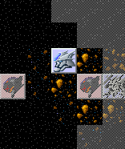
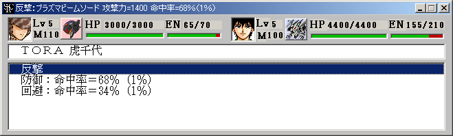
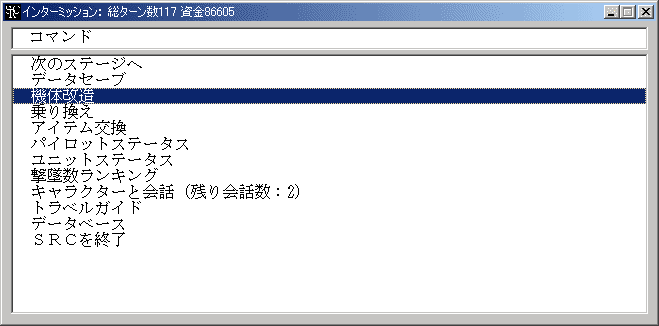

**基本操作**

SRCの操作は基本的にマウスのみで行います。

**左クリック … 選択**

**右クリック … キャンセル**

が原則となっています。

SRCは[メインウインドウ](メインウインドウ)や[メッセージウインドウ](メッセージウインドウ)の右上にあるクローズボタンを押せばいつでも終了できます。ただしこの場合はデータのセーブが行われないため、通常はインターミッションの[終了コマンド](終了コマンド)やマップコマンドの[中断コマンド](中断コマンド)を使って終了して下さい。

**(1)イベントモード**

プロローグやエピローグ等のイベント時にプレイヤーが行うのは基本的にメッセージの更新だけです。[マップウインドウ](マップウインドウ)または[メッセージウインドウ](メッセージウインドウ)をクリックしてメッセージを読んでください。

**マウス位置左クリック右クリック**

**クリック**メッセージ送りメッセージ送り

**押しっぱなし**ウェイト付き早送りウェイト無し早送り

**キャラ画像上**メッセージ自動送り

自動送りを解除するにはマウスカーソルをウインドウ上に置いてクリックすればOKです。

イベントによってはプレイヤーの選択を促されることがあります。選択肢の中から選択したいものを選び、左クリックして下さい。選択肢を表示するダイアログの下部にメーターが表示されている場合は時間制限付きの選択です。気を付けましょう！

**(2)戦闘モード**

戦闘が開始され、味方ユニットの操作が可能になった状態です。

コマンドは各ユニットに対して実行するユニットコマンドとユニット全体に対して実行するマップコマンドの２種類があります。

**マウス位置左クリック右クリック**

**ユニット**ユニットコマンドメニュー武装一覧

**空白地形**マップを掴んで動かすマップコマンドメニュー

右クリックはコマンドのキャンセルにも使用します。

ユニット上で左クリックすると下記のユニットコマンドメニューが表示されます。メニューを消したい場合には右クリック(キャンセル)します。マップ画面外のユニットを操作したい場合にはユニットがいない場所を左クリックしてマップを掴み、ボタンを押したままマップを動かしてください。

ユニットの持つ能力、状態によって表示されるユニットコマンドは異なります。例えば敵が攻撃範囲内にいない場合には攻撃コマンドは表示されませんし、合体能力を持たないユニットでは合体コマンドは表示されません。

**ユニットコマンド名解説**

[移動](移動)ユニットを移動させます

([テレポート](テレポート))テレポートを使ってユニットを移動させます

([ジャンプ](ジャンプ))ジャンプを使ってユニットを移動させます

[攻撃](攻撃)他のユニットを攻撃します

([アビリティ](アビリティ))アビリティを使用します

[会話](会話)隣接したユニットのパイロットに話し掛けます

([修理](修理))隣接したユニットを修理します

([補給](補給))隣接したユニットを補給します

[チャージ](チャージ)チャージを開始します

[スペシャルパワー](スペシャルパワー)スペシャルパワーを使用します

([変形](変形))他の形態に変形します

([分離](分離))複数のユニットに分離します

([ハイパーモード](ハイパーモード))[気力](気力)が一定値以上必要な特殊形態に変形します

([合体](合体))他のユニットと合体します（３体合体以上）

[地上](地上)地上に降ります

[水上](水上)水上に降ります

[空中](空中)空中に移動します

[地中](地中)地中に潜ります

[水中](水中)水中に潜ります

[発進](発進)格納したユニットを発進させます

[アイテム](アイテム)持っているアイテムを使用します

([召喚解除](召喚解除))ユニットの召喚を解除します

[命令](命令)ＮＰＣ扱いの召喚ユニットや魅了したユニットに命令を与えます

[特殊能力一覧](特殊能力一覧)パイロット・ユニットの特殊能力の解説を表示します

[武装一覧](武装一覧)ユニットが持つ武装の一覧表を表示します

[アビリティ一覧](アビリティ一覧)ユニットが持つアビリティの一覧表を表示します

[待機](待機)その場で行動を終了します

名称が括弧付きになっているコマンドはユニットによってコマンド名が変わります。

**例** 変形 =&gt; 戦闘モード変更

移動や攻撃を選択した場合はコマンド選択後に目的地や攻撃目標を選択します。網掛けされていない場所・ユニットが選択可能です。右クリックでコマンドをキャンセルできます。この状態でも左ボタンを押しながらマップを動かせます。

移動や攻撃を実行すると行動終了とみなされ、それ以上のユニットコマンドの実行はできなくなります。ただし攻撃や修理などのコマンドは移動後も使用可能です。詳しくは各コマンドの解説を参照してください。

マップ上に行動可能なユニットがなくなったら、マップコマンドからターン終了を選んで味方フェイズを終了してください。マップコマンドはこの他にもゲームの中断やクイックロード＆セーブ、各種情報の参照にも利用できます。

**マップコマンド名解説**

[ターン終了](ターン終了)味方フェイズを終了します

[中断](中断)データをセーブし、SRCを終了します

[部隊表](部隊表)ユニットの一覧を表示します

[スペシャルパワー検索](スペシャルパワー検索)スペシャルパワーを使えるパイロットを検索します

[全体マップ](全体マップ)全体マップを表示します

[作戦目的](作戦目的)そのステージの勝利条件を表示します

[自動反撃モード](自動反撃モード)自動反撃モードの選択を切り替えます

[設定変更](設定変更)メッセージの表示速度等の各種設定を変更します

[リスタート](リスタート)そのステージを最初からやり直します

[クイックロード](クイックロード)クイックセーブ時点からやり直します

[クイックセーブ](クイックセーブ)データをクイックセーブします

**(3)反撃モード**

敵ユニットからの攻撃を受けた際に反撃手段の選択を行います。

**反撃手段解説**

[反撃](反撃)相手の攻撃後に反撃します

[回避](回避)回避に専念し、敵の攻撃の命中率を半減させます

[防御](防御)防御に専念し、敵の攻撃によるダメージとクリティカル発生率(特殊効果発動率)を半減させます

 ユニットが行動不能やチャージ中の場合には、反撃手段の選択はできません。

[サポートガード](サポートガード)が可能である場合はサポートガードのオン・オフもこの時に選択可能です。

戦闘時にはメッセージやアニメーションが表示されます。これらをスキップしたい場合はマウスの右ボタンを押しっぱなしにしてください。また、[設定変更](設定変更)コマンドでメッセージ速度を変更したり、アニメ表示をオフにしたりすることも出来ます。

**(4)インターミッション**

**コマンド名解説**

[SRCを終了](SRCを終了)SRCを終了します。セーブを忘れずに！

[次のマップへ](次のマップへ)次のステージに進みます

[データセーブ](データセーブ)データを".src"ファイルにセーブします

[機体改造](機体改造)ユニットを改造して強化します

[乗り換え](乗り換え)パイロットを乗せ換えます

[アイテム交換](アイテム交換)アイテムの付け替えを行います

[換装](換装)ユニットの換装を行います。

[パイロットステータス](パイロットステータス)パイロットのステータス一覧を表示します

[ユニットステータス](ユニットステータス)ユニットのステータス一覧を表示します

機体改造、乗り換えとアイテム交換はシナリオ側で[**Option**コマンド](Optionコマンド)により使用可能に設定された場合にのみ表示されます。

ユニットが人間キャラのシナリオでは機体改造の代わりに「ユニットの強化」になります。

また、この場合はパイロットステータスがユニットステータスと統合されることもあります。

換装は換装能力を持つユニットが存在するときにのみ表示されます。

データをセーブし、機体改造等の作業が終ったら「次のマップへ」を選んで次のステージに進んでください。ただし、次のステージのイベントデータファイルがない場合にはその場でSRCは終了します。

シナリオによっては独自のインターミッションコマンドを追加している場合があります。これについては個々のシナリオの解説をご覧下さい。
