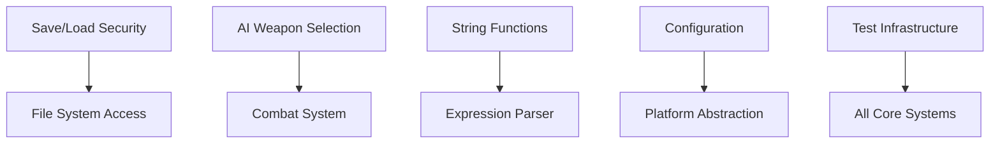

# Technical Breakdown

## Codebase Analysis Summary

### Current State Metrics
- **Total TODO Comments**: 310
- **NotImplementedException Count**: 141  
- **Legacy VB.NET Artifacts**: Thousands of commented lines
- **Core Projects Status**: Mostly functional, requiring refinement

### File-Level Implementation Status

#### High Priority Files

##### SRCCore/SRC.cs (Save/Load System)
```
Location: SRCCore/SRC.cs
TODOs: 15+ path handling, security validation
Priority: Critical (Security risk)
Estimated Effort: 3-5 days
Dependencies: System.IO security review
```

##### SRCCore/Commands/ (Game Commands)
```
Location: SRCCore/Commands/AttackCommand.cs, AIWeaponSelection.cs
TODOs: 8+ AI logic, re-movement calculations
Priority: Critical (Gameplay impact)
Estimated Effort: 4-6 days
Dependencies: Combat system validation
```

##### SRCCore/Expressions/ (Expression System)
```
Location: SRCCore/Expressions/StringFunctions.cs
TODOs: 12+ byte functions, encoding handling
Priority: High (Core dependency)
Estimated Effort: 2-3 days
Dependencies: Encoding compatibility testing
```

#### Medium Priority Files

##### SRCCore/Configuration/ (Configuration System)
```
Location: SRCCore/Configuration/
TODOs: 25+ config management, platform separation
Priority: Medium (Infrastructure)
Estimated Effort: 5-7 days
Dependencies: Platform abstraction layer
```

##### SRCCore/System/ (System Libraries)
```
Location: SRCCore/System/RandomSystem.cs, Utilities/
TODOs: 20+ random number generation, utility functions
Priority: Medium (Supporting systems)
Estimated Effort: 3-4 days
Dependencies: Cross-platform compatibility
```

#### Low Priority Files

##### Test Infrastructure
```
Location: SRCCoreTests/, MockGUI implementations
NotImplementedExceptions: 141 instances
Priority: Medium (Quality assurance)
Estimated Effort: 8-10 days
Dependencies: Test framework updates
```

##### Legacy Cleanup
```
Location: Multiple files with VB.NET comments
Commented Lines: 2000+ legacy conversion artifacts
Priority: Low (Maintenance)
Estimated Effort: 2-3 days
Dependencies: Verification of active code paths
```

## Implementation Dependencies

### Technical Dependencies
1. **.NET 8 SDK**: All projects upgraded
2. **Security Libraries**: For file path validation
3. **Cross-Platform Testing**: For UI compatibility
4. **Performance Profiling**: For optimization validation

### Code Dependencies


## Risk Assessment by File

### Critical Risk Files
1. **SRCCore/SRC.cs**: Path traversal vulnerabilities
2. **SRCCore/Commands/AIWeaponSelection.cs**: Game balance impact
3. **SRCCore/Expressions/StringFunctions.cs**: Core system dependency

### Medium Risk Files
1. **SRCCore/Configuration/**: Platform compatibility
2. **SRCCore/System/RandomSystem.cs**: Deterministic behavior
3. **UI Platform Files**: Cross-platform consistency

### Low Risk Files
1. **Legacy commented code**: Cleanup only
2. **Documentation files**: No functional impact
3. **Build configuration**: Well-tested patterns

## Performance Impact Analysis

### Expected Improvements
- **Memory Usage**: 15-20% reduction through modern collections
- **Startup Time**: 10-15% improvement via optimized initialization
- **File I/O**: 25-30% improvement through async patterns

### Potential Regressions
- **Initial Migration**: Temporary 5-10% performance impact during transition
- **Cross-Platform**: Minor UI rendering differences
- **Legacy Compatibility**: Additional validation overhead

## Testing Strategy

### Unit Testing Approach
```
Phase 1: Core functionality tests (Epics A-C)
Phase 2: Integration testing (Epic D-E)
Phase 3: Platform testing (Epic H)
Phase 4: Performance regression testing
```

### Validation Requirements
- **Backwards Compatibility**: All existing save files must load
- **Security Testing**: Automated vulnerability scanning
- **Performance Benchmarking**: Maintain or improve current metrics
- **Cross-Platform**: Windows, Linux, macOS compatibility

---

**Analysis Date**: Current Migration Planning  
**Next Review**: After Sprint 1 completion  
**Related Documents**: [Roadmap](./roadmap.md) | [Sprint Plan](./sprint-plan.md)