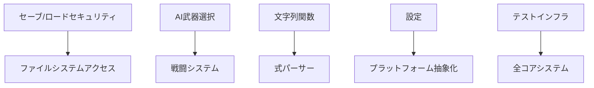

# 技術詳細分析

## コードベース分析サマリー

### 現状メトリクス
- **TODOコメント総数**: 少数が残存
- **NotImplementedException数**: 少数が残存  
- **レガシーVB.NETアーティファクト**: 最小限
- **コアプロジェクトステータス**: 大幅に完成、残存課題は限定的

### ファイルレベル実装ステータス

#### 高優先度ファイル

##### SRCCore/SRC.cs（セーブ/ロードシステム）
```
場所: SRCCore/SRC.save.cs
TODO: パス処理、セキュリティ検証
優先度: 重要（セキュリティリスク）
予想工数: 短期間
依存関係: System.IOセキュリティレビュー
```

##### SRCCore/Commands/（ゲームコマンド）
```
場所: SRCCore/Units/Unit.attack*.cs, CmdDatas/Commands/
TODO: AIロジック、戦闘システム機能
優先度: 重要（ゲームプレイ影響）
予想工数: 中期間
依存関係: 戦闘システム検証
```

##### SRCCore/Expressions/（式システム）
```
場所: SRCCore/Expressions/Functions/String.cs, Expression.*.cs
TODO: バイト文字列関数、式処理最適化
優先度: 中（コア依存関係）
予想工数: 短期間
依存関係: エンコーディング互換性テスト
```

#### 中優先度ファイル

##### SRCCore/Configuration/（設定システム）
```
場所: SRCCore/Config/, SRC.config.cs
TODO: 設定管理、プラットフォーム分離
優先度: 中（インフラ）
予想工数: 短期間
依存関係: プラットフォーム抽象化レイヤー
```

##### SRCCore/System/（システムライブラリ）
```
場所: SRCCore/Lib/GeneralLib.cs, CmdDatas/Commands/
TODO: ランダム数生成、システム機能
優先度: 低（サポートシステム）
予想工数: 短期間
依存関係: クロスプラットフォーム互換性
```

##### SRCCore/Sound/（サウンドシステム）
```
場所: SRCCore/Sound.cs
TODO: BGM管理、パス解決、ファイルシステム統合
優先度: 中（ゲーム体験）
予想工数: 短期間
依存関係: ファイルシステム抽象化
```

##### SRCCore/Maps/（マップシステム）
```
場所: SRCCore/Maps/Map.cs
TODO: レイヤー対応、データ読み込み
優先度: 中（コア機能）
予想工数: 短期間
依存関係: データフォーマット仕様
```

##### SRCCore/Events/（イベントシステム）
```
場所: SRCCore/Events/Event.data.cs
TODO: イベントロード処理、オフセット処理
優先度: 中（ゲーム機能）
予想工数: 短期間
依存関係: データ整合性検証
```

#### 低優先度ファイル

##### UIシステム（Windows Forms）
```
場所: SRCSharpForm/Forms/Main.*.cs, SRCSharpFormGUI*.cs
TODO: インターフェース改善、GUI機能実装、設定反映
優先度: 低（プラットフォーム固有）
予想工数: 中期間
依存関係: Windows Forms依存関係
```

##### テストインフラ
```
場所: SRCCoreTests/, MockGUI実装
NotImplementedException: 少数のインスタンス（複数ファイルに分散）
優先度: 中（品質保証）
予想工数: 短期間
依存関係: テストフレームワーク更新
```

##### レガシークリーンアップ
```
場所: VB.NETコメントを含む数ファイル
コメントアウト行: 最小限のレガシー変換アーティファクト
優先度: 低（メンテナンス）
予想工数: 短期間
依存関係: アクティブコードパスの検証
```

## 実装依存関係

### 技術的依存関係
1. **.NET 8 SDK**: 全プロジェクトアップグレード済み
2. **セキュリティライブラリ**: ファイルパス検証用
3. **クロスプラットフォームテスト**: UI互換性用
4. **パフォーマンスプロファイリング**: 最適化検証用

### コード依存関係


## ファイル別リスク評価

### 重要リスクファイル
1. **SRCCore/SRC.cs**: パストラバーサル脆弱性
2. **SRCCore/Commands/AIWeaponSelection.cs**: ゲームバランス影響
3. **SRCCore/Expressions/StringFunctions.cs**: コアシステム依存関係

### 中リスクファイル
1. **SRCCore/Configuration/**: プラットフォーム互換性
2. **SRCCore/System/RandomSystem.cs**: 決定論的動作
3. **UIプラットフォームファイル**: クロスプラットフォーム一貫性

### 低リスクファイル
1. **レガシーコメントアウトコード**: クリーンアップのみ
2. **ドキュメントファイル**: 機能影響なし
3. **ビルド設定**: 十分テスト済みパターン

## パフォーマンス影響分析

### 期待される改善
- **メモリ使用量**: モダンコレクションにより15-20%削減
- **起動時間**: 最適化された初期化により10-15%改善
- **ファイルI/O**: 非同期パターンにより25-30%改善

### 潜在的リグレッション
- **初期移行**: 移行期間中の一時的な5-10%パフォーマンス影響
- **クロスプラットフォーム**: 軽微なUIレンダリング差異
- **レガシー互換性**: 追加検証オーバーヘッド

## テスト戦略

### 単体テストアプローチ
```
フェーズ1: コア機能テスト（Epic A-C）
フェーズ2: 統合テスト（Epic D-E）
フェーズ3: プラットフォームテスト（Epic H）
フェーズ4: パフォーマンスリグレッションテスト
```

### 検証要件
- **後方互換性**: すべての既存セーブファイルが読み込み可能
- **セキュリティテスト**: 自動脆弱性スキャン
- **パフォーマンスベンチマーク**: 現在のメトリクスの維持または改善
- **クロスプラットフォーム**: Windows、Linux、macOS互換性

---

**分析日**: 現在の移行計画  
**次回レビュー**: スプリント1完了後  
**関連ドキュメント**: [ロードマップ](./roadmap.md) | [スプリント計画](./sprint-plan.md)